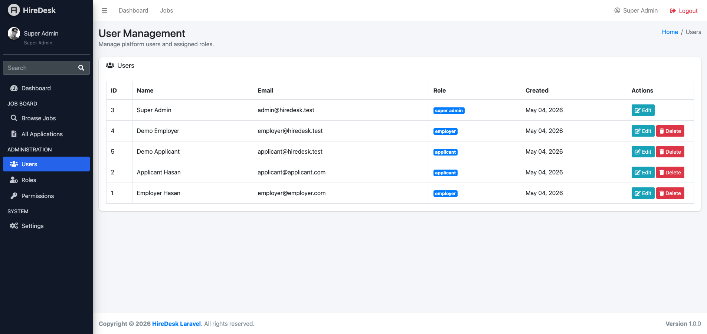
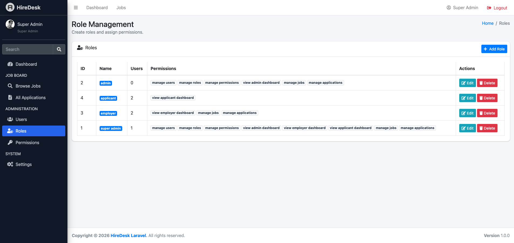
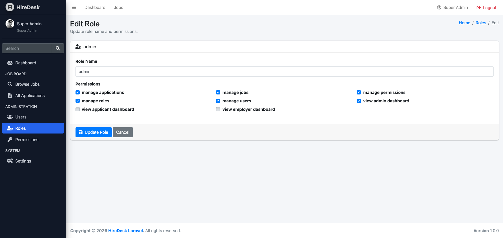
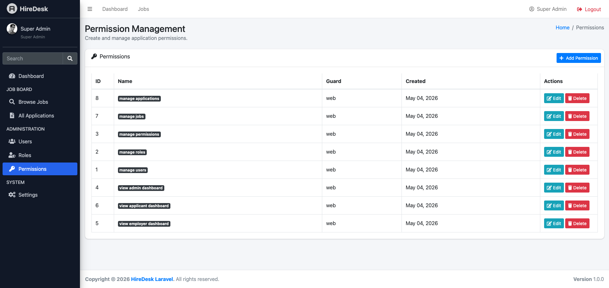

# Laravel Spatie Role Permission

**Laravel Spatie Role Permission** is a free and open-source Laravel 12 starter project that provides a complete role and permission management system using **Spatie Laravel Permission** and **AdminLTE 3.2.0**.

This project helps developers quickly build secure Laravel applications with role-based access control (RBAC), admin dashboards, permission-based route protection, user management, and scalable authorization architecture.

It is designed for developers, freelancers, agencies, SaaS builders, and businesses who want to implement a professional authentication and authorization system without starting from scratch.

---

# 🚀 Project Vision

The goal of this project is to provide a production-friendly Laravel starter focused on authentication, authorization, role management, and permission control.

This project can be used as a foundation for:

- SaaS applications
- Admin dashboards
- CRM systems
- ERP systems
- HR platforms
- Job portals
- School management systems
- Membership platforms
- Internal business tools
- Enterprise applications

---

# 🎯 Why This Project Exists

Many Laravel starter projects only include simple authentication.

This project goes further by implementing a practical and scalable role-based access control system using Spatie Laravel Permission.

It demonstrates real-world Laravel authorization workflows including:

- User management
- Role management
- Permission management
- Protected admin routes
- Role-aware dashboards
- Permission-based architecture
- AdminLTE integration
- RBAC middleware protection

This makes the project useful for learning, client projects, commercial products, SaaS development, and enterprise Laravel applications.

---

# 🛡️ Features

## ✅ Authentication Features

- Laravel authentication
- User registration
- User login/logout
- Remember me functionality
- Password reset
- Role-aware registration flow

---

## ✅ Role & Permission Features

- Spatie Laravel Permission integration
- Role management
- Permission management
- Assign roles to users
- Role-based dashboard access
- Permission-ready architecture
- Role-protected routes
- Middleware-based access control
- Admin-only management routes

---

## ✅ Admin Management Features

- AdminLTE 3.2.0 dashboard
- User management UI
- Role management UI
- Permission management UI
- Sidebar visibility based on role
- Dashboard cards and statistics
- Flash alert system

---

## ✅ Developer-Friendly Features

- Laravel 12 structure
- Production-friendly architecture
- Clean Blade templates
- Organized controllers
- Reusable partials
- Seeder support
- Demo users included
- Permission cache reset support

---

# 📦 Package Used

This project uses:

```txt
spatie/laravel-permission
```

Official package:

https://github.com/spatie/laravel-permission

---

# ⚙️ Installation

Clone the repository:

```bash
git clone https://github.com/hasancse06/laravel-spatie-role-permission.git
```

Go to project directory:

```bash
cd laravel-spatie-role-permission
```

Install dependencies:

```bash
composer install
```

Copy environment file:

```bash
cp .env.example .env
```

Generate application key:

```bash
php artisan key:generate
```

Configure database inside `.env`:

```env
DB_CONNECTION=mysql
DB_HOST=127.0.0.1
DB_PORT=3306
DB_DATABASE=hiredesk
DB_USERNAME=root
DB_PASSWORD=
```

Run migrations:

```bash
php artisan migrate
```

Seed demo data:

```bash
php artisan db:seed
```

Clear optimization cache:

```bash
php artisan optimize:clear
```

Start local server:

```bash
php artisan serve
```

Or, if you are using Laravel Herd, open:

```txt
https://hiredesk-laravel.test
```

## 🙌 Author

**M A Hasan**  
- 🔭 Full-Stack Web Developer | Laravel, WordPress, WooCommerce, Ionic Framework with Angular & REST APIs
- 🌐 About Me [https://hasan.online](https://hasan.online)
- 🎓 Instructor on [Udemy](https://www.udemy.com/user/m-a-hasan-2/)
- 🧠 Creator at [Envato](https://themeforest.net/user/hasanonline)
- ✍️ Blogger at [blog.hasan.online](https://blog.hasan.online)


## ⭐ Support This Project

If you find this useful:
- ⭐ Star the repository on GitHub
- 🔗 Share it with fellow Laravel, Ionic + Angular, WordPress, WooCommerce and Mobile App Developers
- 💡 Contribute with feedback or pull requests


## Screenshots

### Super Admin - Users



### Super Admin - Roles



### Super Admin - Edit Role



### Super Admin - Permissions

